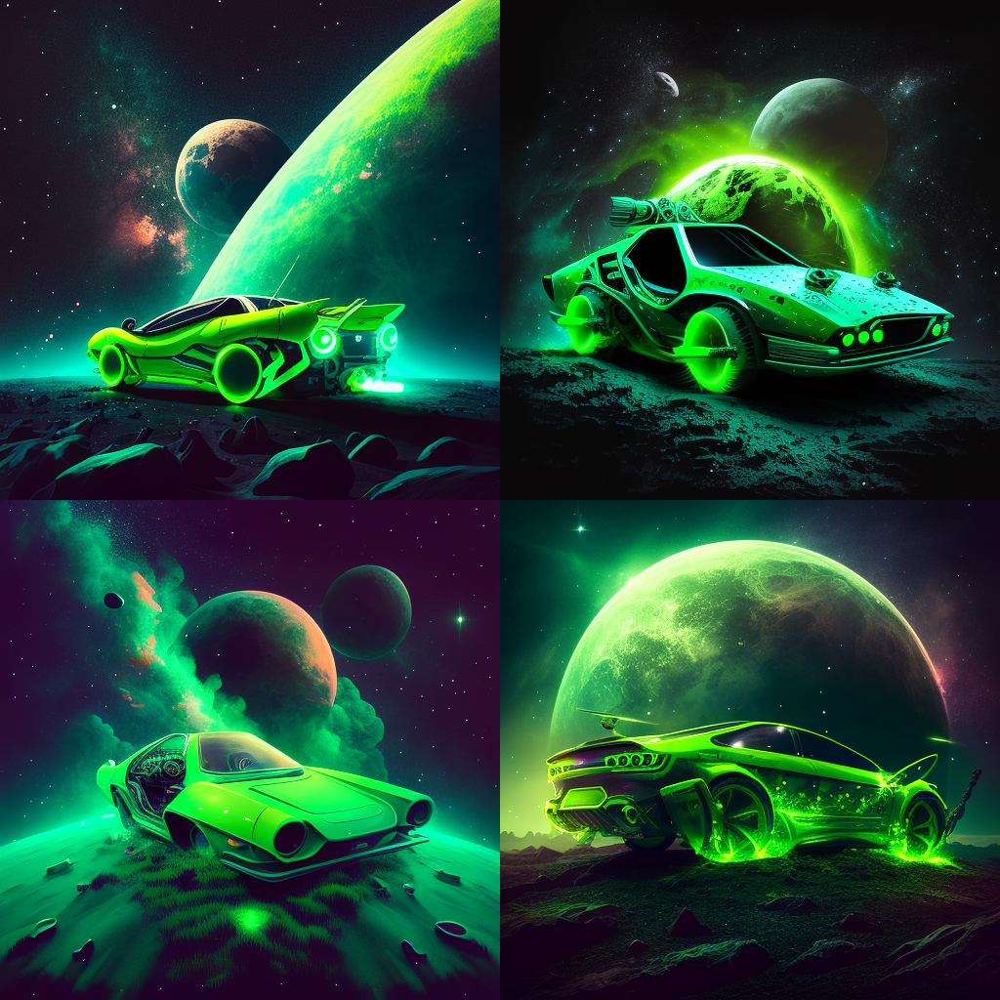

# Nicholas Ho

## Table of Contents

[Intro](index.md#intro)

[CS Stuff](index.md#cs-stuff)

[Animals](index.md#animals)

[Todo List](index.md#todo-list)

## Intro

> "Your focus determines your reality" - Qui-Gon Jinn

Hi, my name is **Nicholas Ho**. I'm from ~~Las Vegas~~. I'm a Sophomore. I really like *Star Wars* and cars. Those are my primary hobbies. I like *Star Wars* because of the revolutionary work done for VFX as well as the emotional weight of the storytelling.

I like cars because of my uncle. He gave me his car and taught me how to fix it up as well as drive it. I have an old Mercedes SLK. My dream cars include the BMW 4 CSL, the Lucid Air Touring, and the Lexus LFA. 

## CS Stuff

`devices = [device for device in devices if device]` - line of code I wrote at my internship

[My favorite programming language](README.md)

CS topics that interest me most:
1. Deepfaking/AI
2. VR/AR
3. Chipmaking
4. Cybersecurity
5. UX/Design

I think generally what interests me in ***CS*** is simply the limitless potential. We can create something that we can't create or do in our own world. I personally don't think I'm the best programmer. I generally like to code in big chunks and then go back and **debug**. I know that's not the best practice, but I feel like I have too many thoughts in my head, and I'd rather just try something and fail then go slowly and safely. 

## Animals

Animals are cool. Here are some cool animals

- Chinchilla
- Capybara
- Octopus
- Komodo Dragon
- Pigs
- Pigeons

## Todo List
- [x] 110 HW
- [ ] 101 HW
- [ ] Research
- [ ] Date